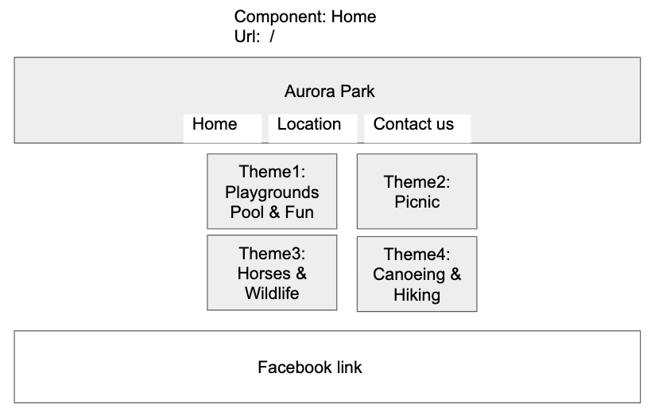
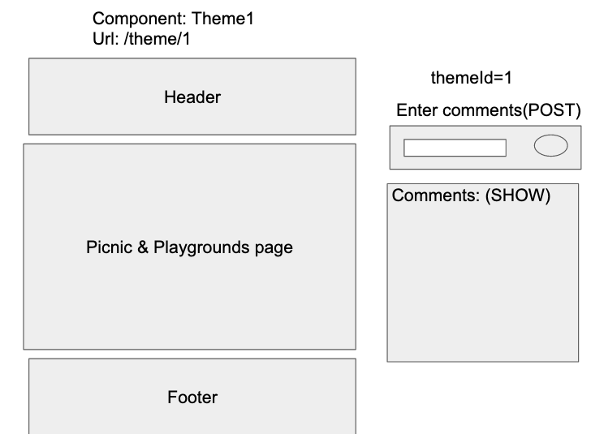
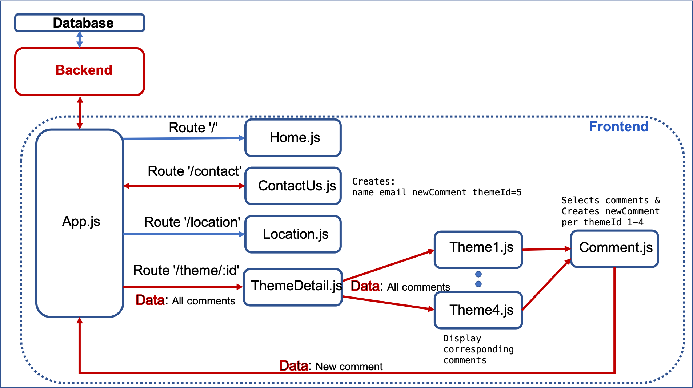
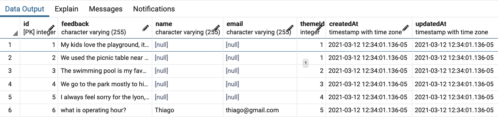
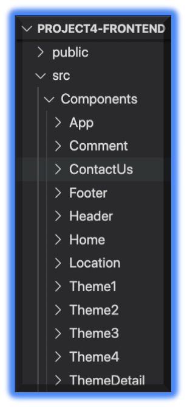
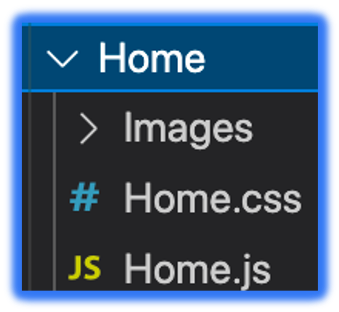

# Project Overview
This project provides an app webpage for a park located in Honduras, Central America. The app allows visitors to enter comments regarding the four theme activities available in the park. Each theme has its corresponding page, where the user can enter its comments and can read the comments provided by others. In addition, there is a Contact-us page where the user can submit its name, email address, and a question. Furthermore, there is a park location page with images of google maps and links to it. 
 
## Team Members
Team lead/instructor: Thiago Cavalcante
- Bingcheng Ni
- Liliana Grajales

## Project Description
For this project, the backend is made with a partial CRUD (Create, Read) app using the Node.js and Postgres. The front end uses React tools. 
The tables and data were sequelized and the deployed in Heroku.

## Project Links

- [https://aurora-park-backend.herokuapp.com/]()
- [https://parque-aurora-frontend.herokuapp.com/]()


## Definitions

Here is a list of the process and tools used:
- Back-end: Node-express-heroku-deployment [https://git.generalassemb.ly/john-deere-sei-7/node-express-heroku-deployment]()
- Front-end: React-heroku-deployment [https://git.generalassemb.ly/john-deere-sei-7/react-heroku-deployment]()
- Documentation [https://expressjs.com/en/4x/api.html]()
- Returning sorted results from a db query [https://stackoverflow.com/questions/36259532/sequelize-findall-sort-order-in-nodejs]()
- Validator [https://git.generalassemb.ly/john-deere-sei-7/react-password-validator/blob/solution/src/Validator.js]()

### Code Development Process
The team first developed the wireframes and discuss the data structure and data display. The team first developed the backend part of the project and mostly did code pairing. The team divided the frontend (REACT) part of the project working first on the data flow from App.js to the different Theme pages. During the developement ideas emerged on how to reorganize the components, dividing the data flow and display between ThemeDetail.js, Theme1-4.js, and Comment.js (see the Component Flow Diagram below). This component arrangement eased the CSS portion of the project, concentrating most of the css in the ThemeDetail.css file. Hence the ThemeDetail.css file directly controlled the css in all four Theme1-4.js pages. 

#### Final Table Relations
Home Page Wireframe
-  <br>
Theme page Wireframe
- <br>
Components Flow Diragram
- <br>
Data Sample
- <br>
Components Folder
- <br>
Single Folder Example
- <br>
Nodemon links (backend):
- [http://localhost:3000/]()
NPM start Links (frontend)
- [http://localhost:3001/]()<br>
Heruko Links:<br>
The following link id=1,2,3,4
- [https://parque-aurora-frontend.herokuapp.com/theme/1]()
- [https://parque-aurora-frontend.herokuapp.com/contact]()
- [https://parque-aurora-frontend.herokuapp.com/location]()


## References
 Use this section to list all supporting libraries and thier role in the project such as Axios, ReactStrap, D3, etc. 
 -[https://github.com/marcwright/deere-project4-express-api-starter]()

## Code Snippet

The following code shows how I had to modify the reference "Trivia" to "Trivias" in the trivia.js file.

```
const backendUrl = "https://aurora-park-backend.herokuapp.com/api";  

class App extends Component {
  constructor(props) {
    super();
    this.state = {
      comments: [],
    };
  }
  
  componentDidMount() {
      this.getAllComments();      
  }

  async getAllComments() {
    const response = await axios.get(`${backendUrl}/comments`);      
    this.setState({
      comments: response.data.comments,
    });
  }
  
  addComment = async (feedback, id, name, email) => {  
    const themeId = parseInt(id)
    await axios.post(`${backendUrl}/comments`, { 
        feedback, themeId, name, email 
    });
    this.getAllComments();
  }

  render() {
    
    return (
      <div className="App">
        <Header></Header>
        {/* <nav>
          <Link to="/">Home</Link>
        </nav> */}
        
        <main>
          <Switch>
            <Route exact path='/' render={routerProps =>  
            <Home {...routerProps} {...this.state} />
            }>
            </Route>
            
            <Route path='/location' render={routerProps =>  
            <Location />
            }>
            </Route>

            <Route path='/contact' render={routerProps =>  
            <ContactUs createComments={this.addComment} {...routerProps}/>
            }>
            </Route>

            <Route path='/theme/:id' render={routerProps =>  
            <ThemeDetail createComments={this.addComment} {...routerProps} {...this.state} />
            }>
            </Route>
          </Switch>
        </main>
        <Footer></Footer>
      </div>
    );
  }
}

export default App;
```

## Issues and Resolutions
The comments section in each theme page had the following problems:

1. Did not  remove the text in the text box after hiting submit but only after a page refresh
2. Did not update the comments displayed list after hitting submit but only after a page refresh
3. Any newly created comment was displayed at the end of the list, instead at the top.

Here is how we fixed those problems:
1. Added a state in this component and changed the input submission mechanism. Instead of using form onSubmit,
it was changed to input onChange to manage the state 
2. Used the async in REACT properly and rearrange our implementation, such that it calls the GET immediately 
after each new POST
3. Changed the backend controller code to utilze ORDER by the updatedAt column when performing database query

## Future additions
1. We would like to have the option for the user to change the pages words between English and Spanish.
2. We would like to add the comments Delete option